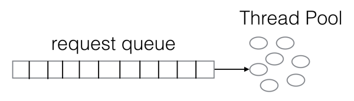
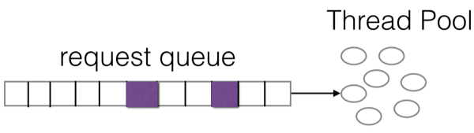
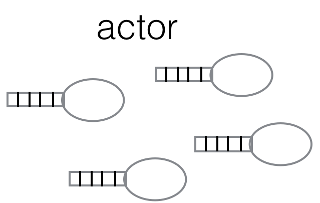

# 消息消费隔离

在公司中，消息中间件这种基础设施一般涉及多个团队公用的情况，即使只有一个团队使用也会存在多个不同的消息主题，多个不同的消费组共享相同的消息服务集群。那么对于这种共享的基础设施如何隔离相互影响，如何做到公平是非常关键的。
对于Consumer端的拉请求而言，其实就是典型的request/reponse方式，那么对于request/response的处理方式一般如下图所示:

这种方式在大部分场景中还是工作的很好的，但是对于消息队列来讲有个很大的问题：比如有一个消息主题，有几个不同的消费组(consumer group)来消费，消费组里是包含多个消费者的。假设A消费组有100个消费者，而B消费组只有两个消费者，这样Server就会收到大量来自A消费组的拉请求，而来自B消费组的拉请求要少得多，最后很可能就是这种情况：

有颜色标记的是来自B消费组的拉请求。可以看到请求队列中大部分都是来自A消费租组的拉请求，这样一来服务端的大部分资源都在为A消费组服务，而B消费组分配的资源将会很少甚至被严重的挤占。这不仅没有隔离影响，而且有失公平。

## Actor
QMQ通过引入类actor处理模型的方式，很好的做到的公平调度，即使某个消费组消费者再多，另外一个消费组的消费者再少也能获得自己应有的时间片。QMQ为每个消费组分配一个actor，那么来自这个消费组的所有拉请求都会进入对应actor的信箱(队列)，然后这些actor再被调度。

这些actor在一个线程池里被调度，当有拉请求进入对应actor的信箱时，该actor的状态变为runnable，进入线程池的队列等待被执行，当执行到该actor时，该actor的信箱里可能存在多个拉请求，那么我们并不是将该拉请求全部执行完毕，而是给每个actor分配了一个最大执行时间(时间片)，如果该时间片耗完，即使它的信箱里仍然有拉请求还是会不再执行该actor，这个时候会将该actor放到线程池队列的末尾。那么就能够确保每个actor都有执行的机会，并且请求多的actor也不会挤占其他actor的资源。

## suspend/resume
引入actor不仅让隔离很容易实现，在处理另外一个问题上也变得很容易。在QMQ的拉取消息时，采用的是类似长轮询的机制，也就是consumer发起一个pull request请求，如果这个时候server端没有所需要的消息，这个pull request不会立即返回，会挂起在这里，consumer是可以设置一个最大等待时间，在这个时间内如果有消息来了，再将消息返回。那么我们在actor里提供suspend/resume操作就很容易实现了这种方式：当actor被处理时，如果发现没有消息，则挂起对应的actor(suspend)，这个时候actor的状态变为suspend，该状态的actor不会被调度，当有server收到对应的消息的时候，我们就可以调用对应actor的resume方法，这样该actor的状态就又切换为runnable状态了。

## 动态限速
虽然在处理资源上我们可以利用actor很好的进行隔离，但是系统的IO却是全局的，我们很难去隔离不同消费者拉取消息时产生的IO对其他消费者的影响。比如我们有个消费组处理消息很慢，这样它对应的消息就会在server端堆积，他的拉取offset就会滞后很多，当滞后到一定的时候这些消息肯定就不再在Page Cache里，这个时候如果要读取这些消息就需要从磁盘读取。这样就会导致磁头来回移动，引起系统的IO剧烈波动。如果该状态得不到控制整个系统将会受到严重的影响。那么一般针对这种关键资源不被抢占的处理措施是限流，比如我们发现有消费组严重堆积的时候，我们就对其拉请求进行限流，这样可以控制它对整个系统的影响，但是限流其实也非常复杂，如果只是简单的人肉限流显然不太智能：
1. 响应慢 等人工发现严重堆积影响到IO时再进行限流可能已经对系统产生了影响
2. 不好确定限流的阈值 限流太少可能起不到作用，而限制了太厉害，可能又过了头，让该消费组得不到应有的资源
这样一般需要比较智能的限流措施，实现起来也不是非常容易。

QMQ借鉴Linux的Process Scheduler很简单的解决这个问题，简单描述Linux Scheduler的运行方式可以是这样：一个系统中有很多进程，有的进程需要很快的响应时间，比如面向用户的，但是它每次运行时间段，比如你移动一下鼠标，需要很快的响应你，但是移动完了又进入长时间休眠。而有一些进程会长时间执行，响应时间对它们并不关键。那么我们是不是要对进程进行分类，然后对各类进程做特殊的处理呢？Linux Scheduler很巧妙的解决了该问题，它将进程的运行时间相加，然后按照进程的总运行时间进行排序，运行时间短的会排在前面，这样就很容易解决了上面的问题了。
那么这又和消息队列中IO堆积有什么关系呢？我们想，如果该消息堆积了，他就需要从磁盘读取消息，这样消耗的时间就越大，那么我们如果将该actor的处理耗时相加排序，将总耗时短的actor排在最前面，而耗时长的排在后面，这样就能达到动态的平衡了，相当于达到了一种类似限速的目的。

Actor和消息消费处理相关代码位于:

[ActorSystem](https://github.com/qunarcorp/qmq/blob/master/qmq-server-common/src/main/java/qunar/tc/qmq/concurrent/ActorSystem.java)

[PullMessageWorker](https://github.com/qunarcorp/qmq/blob/master/qmq-server/src/main/java/qunar/tc/qmq/processor/PullMessageWorker.java)
