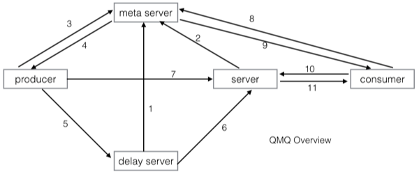
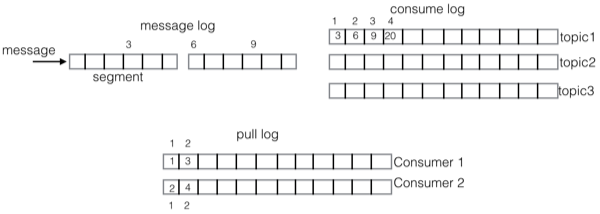
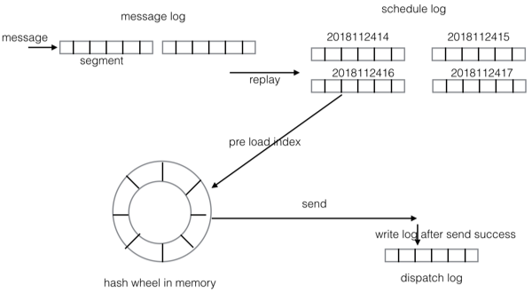

[上一页](design.md)
[回目录](../../README.md)
[下一页](code.md)

# 架构概览
下图是QMQ中各组件及其交互图:
* meta server提供集群管理和集群发现的作用
* server 提供实时消息服务
* delay server 提供延时/定时消息服务，延时消息先在delay server排队，时间到之后再发送给server
* producer 消息生产者
* consumer 消息消费者

根据图中的编号描述一下其交互过程
1. delay server 向meta server注册
2. 实时server 向meta server注册
3. producer在发送消息前需要询问meta server获取server list
4. meta server返回server list给producer(根据producer请求的消息类型返回不同的server list)
5. producer发送延时/定时消息
6. 延时时间已到，delay server将消息投递给实时server
7. producer发送实时消息
8. consumer需要拉取消息，在拉取之前向meta server获取server list(只会获取实时server的list)
9. meta server返回server list给consumer
10. consumer向实时server发起pull请求
11. 实时server将消息返回给consumer

下面分别对实时消息Server和延时/定时消息Server的存储模型进行描述

## 实时消息
在设计背景里，已经描述了QMQ没有采用基于partition存储模型，但是在学习Kafka和RocketMQ的存储实现方式后，有很多地方是值得借鉴的：
* 顺序append文件，提供很好的性能
* 顺序消费文件，使用offset表示消费进度，成本极低
* 将所有subject的消息合并在一起，减少parition数量，可以提供更多的subject(RocketMQ)

在演化QMQ的存储模型时，觉得这几点是非常重要的。那如何在不使用基于partition的情况下，又能得到这些特性呢？正所谓有前辈大师说：计算机中所有问题都可以通过添加一个中间层来解决，一个中间层解决不了那就添加两个。 

我们通过添加一层拉取的log(pull log)来动态映射consumer与partition的逻辑关系，这样不仅解决了consumer的动态扩容缩容问题，还可以继续使用一个offset表示消费进度。

下图是QMQ的存储模型

先解释一下上图中的数字的意义。上图中方框上方的数字，表示该方框在自己log中的偏移，而方框内的数字是该项的内容。比如message log方框上方的数字:3,6,9几表示这几条消息在message log中的偏移。而consume log中方框内的数字3,6,9,20正对应着message log的偏移，表示这几个位置上的消息都是subject1的消息，consume log方框上方的1,2,3,4表示这几个方框在consume log中的逻辑偏移。下面的pull log方框内的内容对应着consume log的逻辑偏移，而pull log方框外的数字表示pull log的逻辑偏移。

在实时Server存储模型中有三种重要的log:
* message log 所有subject的消息进入该log，消息的主存储
* consume log consume log存储的是message log的索引信息
* pull log 每个consumer拉取消息的时候会产生pull log，pull log记录的是拉取的消息在consume log中的sequence

那么消费者就可以使用pull log上的sequence来表示消费进度

## 延时/定时消息
QMQ提供任意时间的延时/定时消息，你可以指定消息在未来两年内(可配置)任意时间内投递。比起RocketMQ提供的多个不同延时level的延时消息，QMQ的延时消息更加灵活。比如在OTA场景中，客人经常是预订未来某个时刻的酒店或者机票，这个时间是不固定的，我们无法使用几个固定的延时level来实现这个场景。

QMQ的延时/定时消息使用的是两层hash wheel来实现的。第一层位于磁盘上，每个小时为一个刻度(默认为一个小时一个刻度，可以根据实际情况在配置里进行调整)，每个刻度会生成一个日志文件(schedule log)，因为QMQ支持两年内的延迟消息(默认支持两年内，可以进行配置修改)，则最多会生成 2 * 366 * 24 = 17568 个文件(如果需要支持的最大延时时间更短，则生成的文件更少)。第二层在内存中，当消息的投递时间即将到来的时候，会将这个小时的消息索引(索引包括消息在schedule log中的offset和size)从磁盘文件加载到内存中的hash wheel上，内存中的hash wheel则是以500ms为一个刻度。

在延时/定时消息里也存在三种log:
* message log 和实时消息里的message log类似，收到消息后append到该log就返回给producer，相当于WAL。
* schedule log 按照投递时间组织，每个小时一个。该log是回放message log后根据延时时间放置对应的log上，这是上面描述的两层hash wheel的第一层，位于磁盘上。schedule log里是包含完整的消息内容的，因为消息内容从message log同步到了schedule log，所以历史message log都可以删除(所以message log只需要占用极小的存储空间，所以我们可以使用低容量高性能的ssd来获取极高的吞吐量，比如采用100G极好的SSD只需要RMB2000左右)。另外，schedule log是按照延时时间组织的，所以延时时间已过的schedule log文件也可以删除。
* dispatch log 延时/定时消息投递成功后写入，主要用于在应用重启后能够确定哪些消息已经投递，dispatch log里写入的是消息的offset，不包含消息内容。当延时server中途重启时，我们需要判断出当前这个刻度(比如一个小时)里的消息有哪些已经投递了则不重复投递。

[上一页](design.md)
[回目录](../../README.md)
[下一页](code.md)
