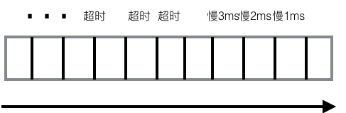

# 防雪崩设计

## 防止队列恶化
在[消息消费隔离](actor.md)这篇文章里提到了QMQ如何利用actor这种方式对不同的消费组进行隔离，但是因为每个actor都有自己的队列，而使用队列的地方都要注意防止队列恶化(姑且就这么叫吧)。说的是什么意思呢，即你的请求都在队列里，那么如果前面处理慢了，就会拖慢整个队列，最后导致整个队列都是做无用功，整个系统的大量资源都被消耗了。

那么QMQ这里就是，拉请求会进入到actor的队列里，如果因为某种原因(比如IO升高)，导致拉请求处理慢，随着每个请求都慢一些，排在队列后面的就更慢，最后从某个点开始这些请求就开始超时。虽然这些超时对于客户端来讲没有收到消息，但实际上Server端所做的工作量一点也不低，一样要实实在在的干活儿，只是干的都是无用功。如果这种情况得不到改善，最后整个队列就完全是废掉的，系统资源也被吃光。

那么针对这一点QMQ在收到每个请求，根据请求的超时参数，都赋予了一个deadline，在该请求在actor里被执行的时候，会首先对deadline进行判断，如果觉得这个请求在deadline之前根本是无法执行完成的，那么我们就直接丢弃这个请求。那么这样就有两个作用：
* 防止队列恶化，减少无用功
* 拖慢消费者 因为请求被直接丢弃了，被丢弃的请求server端没有任何返回，那么consumer端就一直等到这个请求超时，这个时候相当于将consumer端发送拉请求的频率拖慢了，server的压力也进一步得到减轻

## 客户端熔断

deadline机制相当于server的一种自我保护机制，让自己不至于过载。但是我们直接丢弃请求，拖慢了消费者，而消费者并不是只访问这一台server，而如果这个时候恰好其他server的资源比较充足，但是consumer又挂起在资源不足的server上，那也是不合理的。

在这一点上，QMQ引入了客户端的熔断机制。熔断(Circuit Breaker)这个术语随着微服务火起来了，这个一般在服务调用里碰到的比较多，也就是将客户端调用服务分成三种不同的状态：Closed, Open, HalfOpen。在Closed(开关闭合)的时候，与普通的调用没什么两样，这个时候如果服务调用不正常，经过一个策略进行判断(比如连续多长时间超时，或者一段时间内失败率超过多少)，状态就切换为Open(切断)状态，在切断状态里调用不再发给server，当一段时间后状态再切换为HalfOpen，在HalfOpen里只有少数请求会发给server，一旦这些请求都成功了，状态又恢复成Closed状态。

熔断这种模式是非常有用的，对客户端和服务端都是一种保护机制。那么在QMQ里我们也引入了这种机制，当一台Server被熔断后一段时间内拉请求(也包括发送消息的)不再发给这台Server，这样客户端也不会挂起在资源不足的server上，而server也进一步得到喘息的机会，当一段时间后客户端会用少量的请求对server进行探测，一旦server完全恢复则请求会再次在多台server之间均分。

那么QMQ就是通过服务端的deadline机制和客户端的熔断机制来确保服务端不至于过载，即使短暂过载也能很快从过载状态恢复回来。