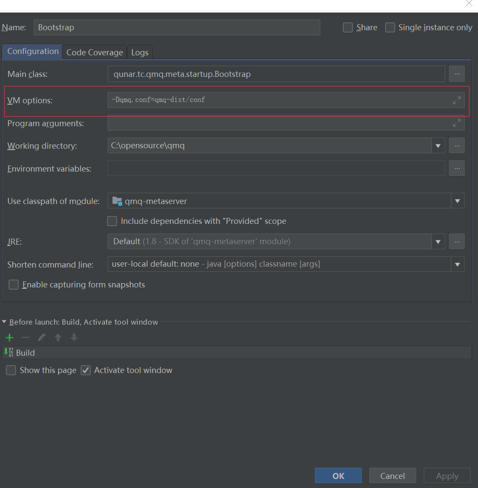

[上一页](backup.md)
[回目录](../../README.md)
[下一页](operations.md)

# 在IDE里运行代码

如果想在IDE里来运行代码了解QMQ的运行原理可以按照下面的步骤进行

### clone code
```
git clone https://github.com/qunarcorp/qmq.git
```

### init database
使用 qmq-dist\sql\init.sql 初始化数据库

### init config
按照[安装](install.md)里描述的配置对qmq-dist\conf里的配置文件进行对应的修改

### config env
以Intellij IDEA为例



[上一页](backup.md)
[回目录](../../README.md)
[下一页](operations.md)