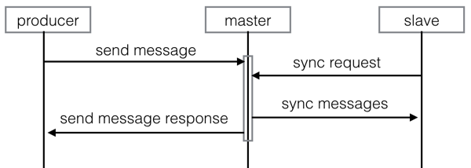

[上一页](code.md)
[回目录](../../README.md)
[下一页](monitor.md)

# 高可用(HA)

QMQ分别从两个角度提供高可用能力：分片和复制

首先因为QMQ不是基于partition的，所以很容易通过添加更多的机器就能提高一个subject的可用性，消息按照一定的负载均衡策略分布在不同的机器上，某台机器离线后producer将不再将消息发送给该Server。

除此之外，QMQ通过主从复制来提高单机可用性。QMQ将服务端集群划分为多个group，每个group包含一个master和一个slave。消息的发送和消费全部指向master，slave只为保证可用性。

当消息发送给master后，slave会从master同步消息，只有消息同步到slave后master才会返回成功的响应给producer，这就保证了master和slave上都有一致的消息。当master和slave之间的延迟增大时，会标记该group为readonly状态，这个时候将不再接收消息，只提供消息消费服务。下图为消息发送和主从同步示意图:



目前当master离线后，不提供自动切换功能，需要人工启动master。当slave离线后，该group不再提供接收消息服务，只提供消息消费服务。当master出现故障，导致消息丢失时，可以将其切换为slave，原来的slave切换为master，slave将从master同步数据，同步完成后提供服务。

# 最小化部署

为了可用性建议按照如下配置进行最小化部署

## metaserver

部署两台应用，然后配置nginx作为负载均衡。metaserver依赖mysql，请确保mysql的可用性，但metaserver运行时不强依赖mysql，如果mysql故障，只会影响新上线的消息主题和新上线的消费者，对已有的无影响。

## broker

部署两组，每组为一主一从两台，则至少部署4台

## delay server

同broker部署方式(如没有延时消息可以不部署)

## watchdog
建议部署两台，但某个时刻只有一台工作，当一台故障会自动切换(如无事务或持久化消息可以不部署)

# 主从切换

目前开源的版本暂不支持自动主从切换机制，如果发生机器故障需要主从切换，需要人工介入，下面描述人工主从切换的步骤：

1. 将某组设置为readonly，设置readonly之后，该组将不再接受新的消息。需要注意的是并不是设置readonly后会立即就不接受新消息了，客户端需要一定的时候刷新路由，这个时间默认在1分钟左右，你可以通过观察server的receivedMessagesCount监控来确定完全没有消息进入了。使用下面的命令设置readonly：
```
tools.sh MarkReadonly --metaserver=<metaserver address> --token=<token> --brokerGroup=<broker group name>
```

2. 等待主从完全同步，一般来讲，如果打开了wait.slave.wrote，则停止接受新消息后应该主从就已经同步上了，但是你也可以通过观察master的slaveMessageLogLag监控了解

3. 停止slave， 停止master

4. 执行ReplaceBroker命令切换角色(该步骤一定要在停止应用之后执行)

```
//将原来的master里机器名，ip等修改为原来的slave
tools.sh ReplaceBroker --metaserver=<metaserver address> --token=<token> --brokerGroup=<broker group name> --role=<0, 0是master> --hostname=<原slave的机器名> --ip=<原slave的ip> --servePort=<原slave的servePort> --syncPort=<原slave的syncPort>

//将原来的slave里机器名，ip等修改为原来的slave
tools.sh ReplaceBroker --metaserver=<metaserver address> --token=<token> --brokerGroup=<broker group name> --role=<1, 1是slave> --hostname=<原master的机器名> --ip=<原master的ip> --servePort=<原master的servePort> --syncPort=<原master的syncPort>
```

5. 启动slave， 启动master

[上一页](code.md)
[回目录](../../README.md)
[下一页](monitor.md)
