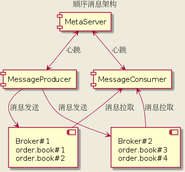
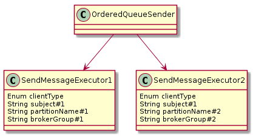
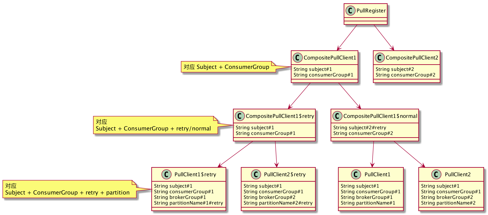
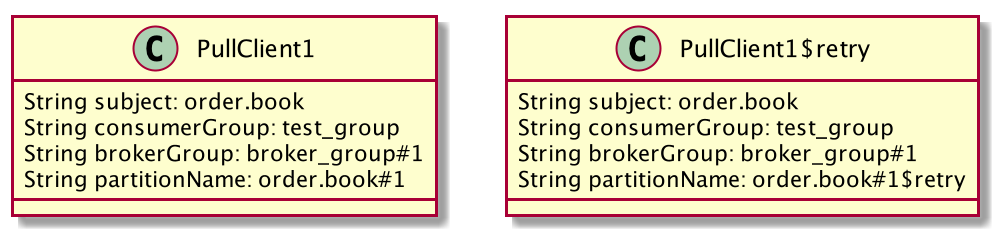
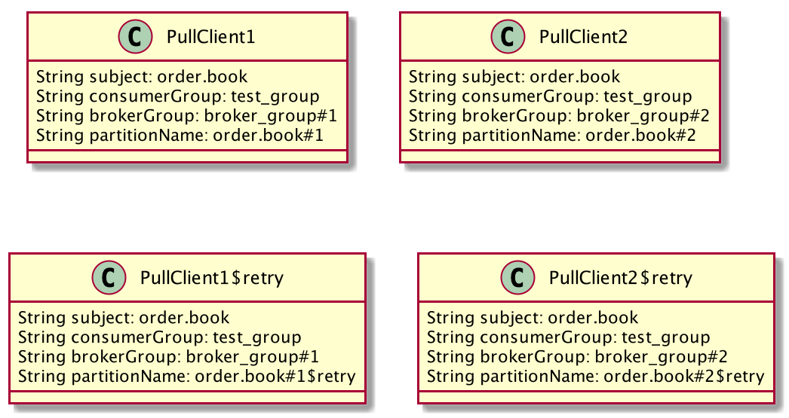

# 概述

对 QMQ 消息模型进行重新设计, 使其消息具备顺序消费功能, 顺序消费即消费顺序与消息发送时序相同. 与 Kafka 和 Rocket MQ 类似, 我们只实现部分消息有序, 而非全局有序, 即特定 key 相同的消息有序. 为了达到找个目的, 需要对消息整体的概念进行重新设计, 使之同时支持新老版本客户端逻辑和服务端存储. 

从总体来看, 我们交互流程和存储如下:



上图表示 Broker 共有两个 Group #1, #2. 而 Subject 为 order.book 的消息共有 4 个分区, 其中 #1 #2 分区位于 BrokerGroup#1, order.book#3 #4 位于 BrokerGroup#2

# 基本概念

## Subject

主题, 即客户端发送消息时设置的 Subject, 一个 Subject 可能会对应多个 Partition, 对用户和 MetaServer 而言, 所有的配置都是针对 Subject 维度进行配置

## Partition

Subject 在 Broker 上的存储实体, 每个存储实体即为一个 Partition, 每个 Partition 由 [BrokerGroup, PartitionName] 唯一确定, 如 order.book 这个主题, 4 个 Partition 分别为:

```text
[Broker#1, order.book#1]
[Broker#1, order.book#2]
[Broker#2, order.book#3]
[Broker#2, order.book#4]
```

其中, PartitionName 可以与 Subject 相同 (例如旧版本的消息存储), 如下:

```text
[Broker#1, order.book]
[Broker#2, order.book]
```

Partition 的映射关系由 Meta Server 负责维护, 至此, 我们对 Client 的 Subject 概念与 Broker 的 Partition 概念进行分离, 对于 Meta Server 来说, 所有的配置项均对 Subject 维度生效, 而对于 Broker 来说, 则不关心 Subject 是什么, 只关注 PartitionName, PartitionName 甚至可以是与 Subject 无关的 UUID.

# Partition 路由

Producer 在消息的发送过程中, 需要确立一个当前消息 Message 实体与 Partition 的对应关系, 才能最终的落到消息存储文件中. 

## 路由表

MetaServer 负责维护所有 Subject 与 Partition 之间的路由关系, 并通过心跳响应将路由关系更新到客户端

### 默认路由

所有客户端在首次与 MetaServer 通信时, 若没有手工分配路由关系, 会获得默认路由关系, 默认路由回返回 2 个当前可用的 BrokerGroup, 且此路由关系永远不变. 例如:

order.book => [Broker#1, order.book]
order.book => [Broker#2, order.book]

### 路由扩容

由于有序消费 Consumer 与 Partition 一对一绑定,  所以默认情况下的最大并发消费客户端数 (并非最大并发消费线程数, 理论上最大并发消费线程数为 LogicalParititionKey 的数量) 为 2, 如果当前消费能力不足, 需要进行 Consumer 数量扩容, 则需要对路由关系进行变更, 例如, 我们需要将 Partition 数从 2 变为 4, 则路由关系变为如下

order.book => [Broker#1, order.book]
order.book => [Broker#2, order.book]
order.book => [Broker#1, order.book#1]
order.book => [Broker#2, order.book#2]

## 路由算法

路由表确定以后, 需要有一个具体的算法来确定具体的 Message 实体落到哪一个 Partition. 对于 Broker 上的 Partition, 我们又称为物理分区(PhysicalPartition, PP), 此外我们预设 1024 个逻辑分区(LogicalPartition, LP),  LP 会以 Range 的形式与 PP 对应, 例如:

```text
LP[0, 512) => PP#1
LP[512, 1024) => PP#2
```

对于 Message, 需要有一个字段 (OrderKey) 用于寻找 LP,  OrderKey 由用户自己设置 (例如使用订单号, 用户 UID 等), OrderKey 相同的消息, 可保证顺序消费模式下, Consumer 按照 Producer 的发送顺序来消费消息. 其具体映射流程如下:

1. OrderKey % LP => LP :  通过 OrderKey 确定 LP
2. LP => PP : 通过路由表和 LP 确定 PP
3. Message 发送到 PP 对应的 Broker
4. 对于未设置 OrderKey 的消息, 我们使用随机数随机选择一个 LP 进行发送

# Producer 设计
 

 
Producer 对消息进行分组, 每个分组分配一个 MessageExecutor 负责处理, 分组的元组为 [ClientType, Subject, PartitionName, BrokerGroup], 每个 Executor 负责一个队列的消息.

对于有序/无序消息, 使用相同的异步发送逻辑, 不同点在于消息发送的路由选择阶段的策略. 

是否是有序仅仅取决于 Message 是否设置 OrderKey, 而是否设置 OrderKey 的区别, 仅在于路由阶段对 Partition 的路由选择, 即有 OrderKey 的使用 OrderKey 计算 LogicalPartition, 而没有 OrderKey 的是随机选择 LP.

## OrderStrategy

OrderStrategy 即顺序策略, 策略的影响维度是 Subject, 由用户手动设置. 分为严格有序 (Strict) 和 尽量有序 (BestTried), 顺序策略会影响消息发送失败时的处理. 默认情况下, 所有消息 (不管是有序还是无序, 都是 BestTried 策略)

* Strict: 消息发送失败后, 消息不会从 SendMessageExecutor 出队, 即下一个发送周期, 还是会发送这个消息, 且 Partition 路由不会发生改变. Strict 模式下, 消息不会产生 %retry% 主题, 这是为了防止乱序消息的产生
* BestTried: 消息发送失败后, 如果超过最大重试次数, 会将出队 (即发送失败, 等待扫库任务重新发送), 若未达到最大重试次数, 则重新选择一个可用的 Partition 发送消息, 此时, 若 Partition 发生切换 (如原来的 BrokerGroup 处于 NRW 状态), 有可能会导致消息发生乱序

# Consumer 设计

## 整体结构



如上所示, Consumer 拉取结构大致分为三层

### PullRegister

负责注册所有的 CompositePullClient

### CompositePullClient

每个 CompositePullClient 代表 Subject+ConsumerGroup, 负责管理底下的 Retry + 非 Retry 的 PullClient, 这一层是虚拟结构, 不负责实际的消息拉取

### CompositePullClient (Retry/Normal)

每个 CompositePullClient 代表 Retry 或 NonRetry 的 PullClient, 这层也是虚拟结构不负责消息拉取

### PullClient

最底层的 PullClient, 负责实际的消息拉取, 每个 PullClient 与一个具体的 Partition 相对应, 也就是每个对应 Subject+ConsumerGroup+BrokerGroup+Partition

## 分区与分配

Consumer 具体如何生成上图的这种树形结构依赖于 MetaServer 对该 ClientId 对应的应用的分区分配, 假设对于 Subject "order.book", 分配给  clientId 为 "192.168.1.1" 的 Consumer 来说,  拥有如下的分配表

```json
{
    "192.168.1.1": [
        "order.book#1@broker_group#1"
    ],
    "192.168.1.2": [
        "order.book#2@broker_group#2"
    ]
}
```

在 "192.168.1.1" 这个 Client 上, 实际生成 PullClient 的时候, 会生成如下几个



若分配表发生变更, 如变为

```json
{
    "192.168.1.1" : [
        "order.book#1@broker_group#1",
        "order.book#2@broker_group#2"
    ]
}

```

则生成 PullClient 变为如下:



## IsOrder

用户可以为 Consumer 设置 isOrder 参数, 代表该 Consumer 是否是顺序消费, 维度是 Subject+Group, 但最终 Consumer 是否能够进行顺序消费, 依赖于 Consumer 与 MetaServer 的 心跳中返回的 ConsumeStrategy 参数, 只有返回的 ConsumeStrategy 为 Exclusive 时, 才会进行顺序消费. 顺序消费会使 Consumer 对消息的消费顺序按照发送顺序进行, 最终效果会受到  OrderStrategy 影响

### Strict

消费异常时: 消息将重新入队, 再次消费, 并且不会发出 %retry% 消息
消息未 ACK 时: 消息将重新入队, 再次消费

### Best Tried

消费异常时: 发送 %retry% 消息, 并消费下一条消息
消息未 ACK 时:  继续消费下一条消息

## ConsumeStrategy

消费策略, 该参数由 Meta Server 在心跳中返回给 Consumer, 会影响 Consumer 的消费行为, 分为 Exclusive 和 Shared.

### Exclusive

exclusive 是独占消费的意思, 从原理上来讲, 顺序消费和广播消费都是独占消费, 即每个 Partition 只有一个 Consumer 在消费, 且不使用 PullLog 记录 ACK/Pull offset, 而是直接使用 ConsumerLog.

### Shared

shared 指的是共享消费, 即原来的多个 Client 可以共同消费一个 Partition, 这种模式并发度更高, 但不能保证顺序, ACK/Pull offset 通过 PullLog 文件实现.

## 分区重分配 

MetaServer 会在服务端维护所有 Client 的心跳状态, 其中 ConsumeStrategy 类型为 Exclusive(独占消费) 的 Consumer, 其在线状态会保存在数据库中, 更新 Consumer 在线状态的方式有:

定时心跳请求, 根据心跳请求中的在线状态字段, 将其更新到数据库
在 Client 上下线状态切换时, 会主动触发心跳, 将其上下线状态更新到数据库, 并触发分区重分配任务
Meta Server 定时任务会监控所有 Exclusive 的 Consumer 在线状态, 一旦在线的 Consumer 列表发生变更, 则会触发重分配任务

## 消息消费权限

每次心跳过后, Consumer 收到的响应中会带有 Meta Server 对 Consumer 消费消息的授权权限时间戳,  Exclusive Consumer 每次处理消息之前, 会检查授权时间, 若当前时间超过授权时间, 则不会再处理消息.

这个授权超时时间会设置得跟判断 Exclusive Consumer 的在线状态超时时间一样, 即尽量做到 Exclusive Consumer 与 Meta Server 失去心跳后, MetaServer 在判断 Consumer 掉线时, Consumer 自身在本地也不再消费消息. 这样可以保证在 Meta Server 发现 Consumer 掉线后, 重新分配 partition 分区时, 掉线的 Consumer 已经停止消费, 这样新分配的 Consumer 拉取消息时, 可以尽量避免与旧的 Consumer 重复消费和乱序的情况.

## 消息拉取锁 (Pull Lock)

要保证顺序消费, 就必须保证一个 Partition 只能与一个 Consumer 绑定, 那么则需要在 Broker 对 Partition 加锁, 锁的维度是 Subject+ConsumerGroup+PartitionName 只有当锁释放后, 新的 Consumer 才能与 Partition 重新绑定. 锁释放有两种机制:

超时, 每次锁的锁定有一个超时时间, 该时间在每次 Pull 的时候会刷新, 如果超时时间达到, 会自动释放锁
主动释放锁, Client 在 destroy 时会调用 releaseLock 接口, 主动释放锁 (如 PullEntry 的 destory)

## Consumer 上下线移交

在 Consumer 分区分配发生更新后, 可能出现 ConsumerA 将 PartitionA 消费权限移交给 ConsumerB 的情况, 从大致上移交流程如下:

1. Meta Server 下发分配信息给 ConsumerA / ConsumerB
2. ConsumerA 下线, 进行清理工作
3. ConsumerB 上线, 并等待 ConsumerA 完全下线以获取 PartitionA Broker 消费锁
4. ConsumerA 完全下线, ConsumerB 获取消费锁, 开始消费

### ConsumerA 下线

下线流程如下:

1. 停止消息拉取
2. 释放 PullLock
3. 销毁 AckSendQueue (等待所有 AckEntry 被处理完成, 拒绝新的 ACK 请求)