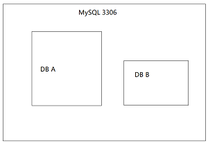
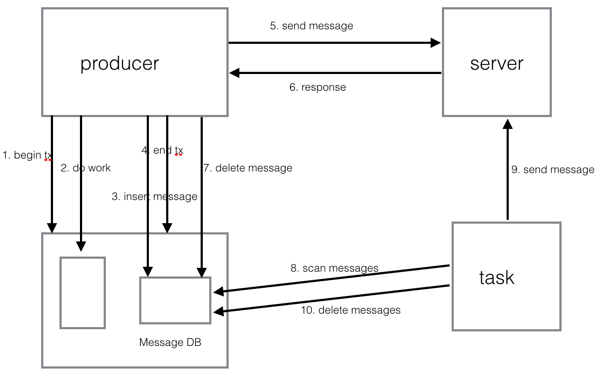

[上一页](unittest.md)
[回目录](../../README.md)
[下一页](consumer.md)

# 事务消息

## 概述
如果要在交易等场景中使用消息，则一致性是非常关键的需求。也就是不能出现业务操作成功消息未发出或者消息发出了但是业务并没有成功的情况。举例来说，支付服务使用消息通知出票服务，那么不能出现支付成功，但是消息没有发出，这会引起用户投诉；但是也不能出现支付未成功，但是消息发出最后出票了，这会导致公司损失。总结一下就是发消息和业务需要有事务保证。

提到一致性，大家肯定就想到事务，而一提到事务，肯定就想到关系型数据库，那么我们是不是可以借助关系型DB里久经考验的事务来实现这个一致性呢。我们以MySQL为例，对于MySQL中同一个实例里面的db，如果共享相同的Connection的话是可以在同一个事务里的。以下图为例，我们有一个MySQL实例监听在3306端口上，然后该实例上有A,B两个DB，那么下面的伪代码是可以跑在同一个事务里的：



```sql
begin transaction
insert into A.tbl1(name, age) values('admin', 18);
insert into B.tbl2(num) values(20);
end transaction
```
有了这层保证，我们就可以透明的实现业务操作和消息发送在同一个事务里了，首先我们在公司所有MySQL实例里初始化出一个message db，这个可以放到自动化流程中，对应用透明。然后我们只要将发消息与业务操作放到同一个DB事务里即可。

我们来看一个实际的场景：在支付场景中，支付成功后我们需要插入一条支付流水，并且发送一条支付完成的消息通知其他系统。那么这里插入支付流水和发送消息就需要是一致的，任何一步没有成功最后都会导致问题。那么就有下面的代码:
```java
@Transactional
public void pay(Order order){
    PayTransaction t = buildPayTransaction(order);
    payDao.append(t);
    producer.sendMessage(buildMessage(t));
}
```
上面的代码可以用下面的伪代码解释：
```java
@Transactional
public void pay(Order order){
    PayTransaction t = buildPayTransaction(order);
    payDao.append(t);
    //producer.sendMessage(buildMessage(t));
    final Message message = buildMessage(t);
    messageDao.insert(message);
    //在事务提交后执行
    triggerAfterTransactionCommit(()->{
        messageClient.send(message);
        messageDao.delete(message);
    });
}
```
实际上在producer.sendMessage执行的时候，消息并没有通过网络发送出去，而仅仅是往业务DB同一个实例上的消息库插入了一条记录，然后注册事务的回调，在这个事务真正提交后消息才从网络发送出去，这个时候如果发送到server成功的话消息会被立即删除掉。而如果消息发送失败则消息就留在消息库里，这个时候我们会有一个补偿任务会将这些消息从消息库里捞出然后重新发送，直到发送成功。整个流程就如下图所示：



1. begin tx 开启本地事务
2. do work 执行业务操作
3. insert message 向同实例消息库插入消息
4. end tx 事务提交
5. send message 网络向server发送消息
6. reponse server回应消息
7. delete message 如果server回复成功则删除消息
8. scan messages 补偿任务扫描未发送消息
9. send message 补偿任务补偿消息
10. delete messages 补偿任务删除补偿成功的消息

## QMQ事务消息的使用方法

### 发送消息
在java里一般我们使用Spring的事务管理器来提供事务，QMQ提供了内置Spring事务的方式，使用起来非常方便:

在需要放在同一个事务的业务db的相同实例上创建QMQ的数据库，这个过程如果公司方便的话，可以直接合并进DBA的初始化数据库的自动化流程中，这样就透明了：
```sql
CREATE DATABASE `qmq_produce`;
CREATE TABLE `qmq_msg_queue` (
  `id` bigint(20) NOT NULL AUTO_INCREMENT COMMENT '主键',
  `content` longtext NOT NULL,
  `status` smallint(6) NOT NULL DEFAULT '0' COMMENT '消息状态',
  `error` int unsigned NOT NULL DEFAULT '0' COMMENT '错误次数',
  `create_time` datetime NOT NULL COMMENT '创建时间',
  `update_time` timestamp NOT NULL DEFAULT CURRENT_TIMESTAMP ON UPDATE CURRENT_TIMESTAMP COMMENT '更新时间',
  PRIMARY KEY (`id`)
) ENGINE=InnoDB DEFAULT CHARSET=utf8mb4 COMMENT='记录业务系统消息';
```

以下是Spring中的xml配置，下面的dataSource所指向的
```xml
    <!-- 配置数据源，业务操作和qmq共享使用 -->
    <bean id="dataSource" class="org.apache.tomcat.jdbc.pool.DataSource" destroy-method="close">
        <property name="driverClassName" value="${jdbc.driverClassName}"/>
        <property name="url" value="${jdbc.url}"/>
        <property name="username" value="${jdbc.username}"/>
        <property name="password" value="${jdbc.password}"/>
        <property name="maxActive" value="50"/>
        <property name="maxIdle" value="5"/>
        <property name="maxWait" value="3000"/>
        <property name="validationQuery" value="select 1"/>
        <property name="testOnBorrow" value="true"/>
    </bean>

    <bean id="transactionProvider" class="qunar.tc.qmq.producer.tx.spring.SpringTransactionProvider">
        <constructor-arg name="bizDataSource" ref="dataSource" />
    </bean>

    <bean id="messageProducer" class="qunar.tc.qmq.producer.MessageProducerProvider">
        <property name="transactionProvider" ref="transactionProvider" />
    </bean>
```
下面看发送消息的代码，也很简单:

```java

@Service
public class PayService{

    @Resource
    private PayDao payDao;

    @Resource
    private MessageProducer messageProducer;

    @Transactional
    public void pay(Order order){
        PayTransaction t = buildTransaction(order);
        payDao.append(t);

        Message message = messageProducer.generateMessage("order.payok");
        message.setProperty("orderId", order.getOrderId());
        messageProducer.sendMessage(message);
    }
}
```

上面就完成了事务消息了，可以确保支付流水插入成功，消息才会发送出去，消息发送出去了，事务流水一定插入成功，不会一个成功一个失败。

### 补偿任务

在使用事务消息之前需要启动补偿任务服务，使用bin/watchdog.sh 来启动补偿任务服务。为了高可用，最好部署多个补偿任务实例，watchdog实现了选举机制，某个时刻只有一个实例在运行，当该实例出现问题时会自动切换到其他实例。

如果某一个库需要用于事务消息，则需要将其注册，这样补偿任务就可以对其中的消息进行补偿了，使用下面的命令将其注册(后面我们会提供注册界面)。

```
>tools.sh AddDb --metaserver=<metaserver address> --token=<token> --host=<db host> --port=<db port> --username=<db username> --password=<db password>
```

[上一页](unittest.md)
[回目录](../../README.md)
[下一页](consumer.md)
